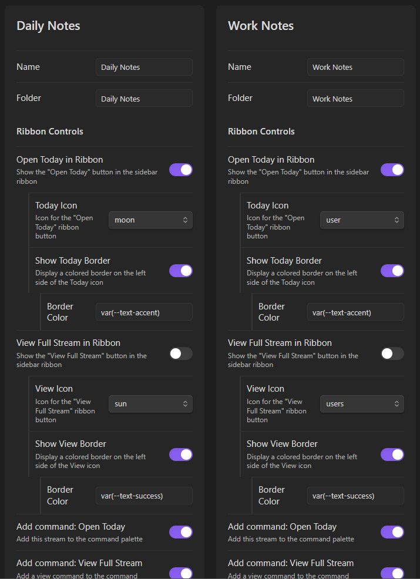
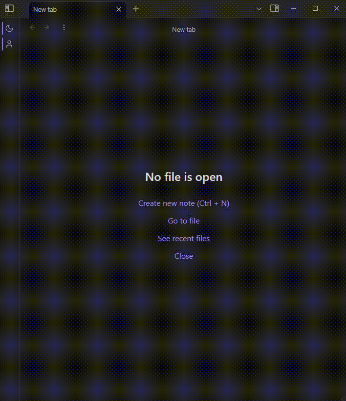
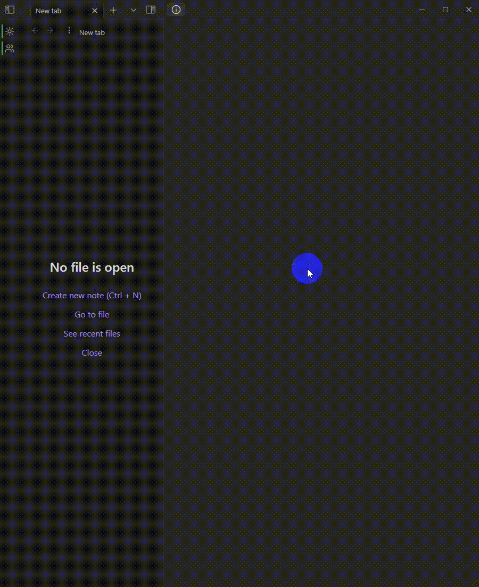

# Streams

*Create and manage multiple daily note streams*

Replaces the Daily Note core plugin.
Inspired by the Periodic Notes and Calendar plugins.

## Getting started
- Add new stream in settings, "Daily Notes", that points to where you store your daily notes. There will be a ribbon button and a command to get to Today's Daily Note. Enable Full Stream view to get a view into your stream history.
- Then create another stream for work?
- Then create another stream for school?
- Then create another stream for... whatever.

## Configure Streams

## Each Stream's Daily Note

## View Full Stream
