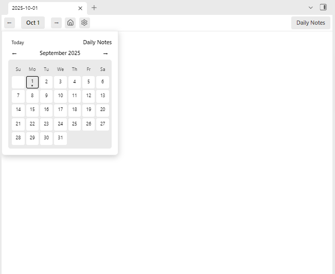
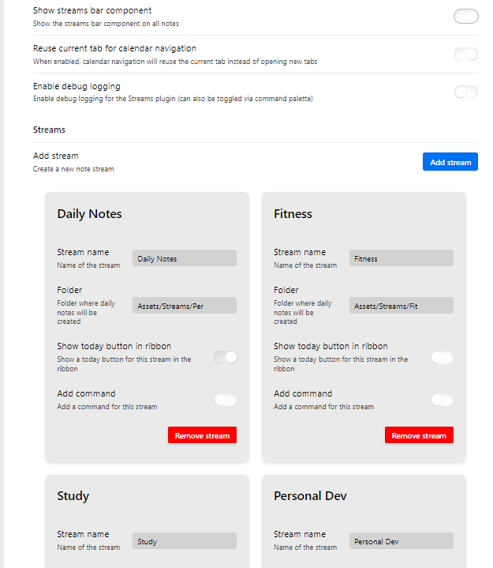
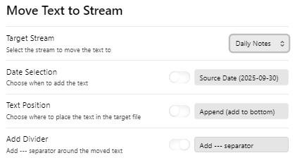

# Streams

*Create and manage multiple daily note streams*

- > Replaces the Daily Note core plugin.
- > Inspired by the Periodic Notes and Calendar plugins.


## Support

If you find this plugin helpful, please consider supporting its development:

[](https://github.com/sponsors/bfloydd)
[](https://buymeacoffee.com/floydpro)
[](https://venmo.com/floydpro?txn=pay)
[](https://paypal.me/bfloydd)

**Donation Options:**
- [GitHub Sponsors](https://github.com/sponsors/bfloydd) - Monthly sponsorship ❤️
- [Buy Me a Coffee](https://buymeacoffee.com/floydpro) - Support with a coffee ☕
- [Venmo](https://venmo.com/floydpro?txn=pay) - Quick mobile payment
- [PayPal](https://paypal.me/bfloydd) - Direct PayPal donation

Your support helps maintain and improve this plugin! 🙏


## Features
- Multiple daily note streams.
- Full calendar for each stream.
- New view for missing notes.
- **Public API** for other plugins to access stream data.

## Benefits
- Divide up messy Daily Notes.
- Create a private stream for work.
- Encrypt a single stream for added data security.
- Quickly find and add notes.

## Getting started
- Add new stream in settings, "Daily Notes", pointing to where you store your daily notes.
- Then create another stream for Work of School.
- Use the navigation bar to select any stream.

## Streams Widget


## Configure Streams


## Move content between streams


## Public API for Other Plugins

The Streams plugin provides a public API that other Obsidian plugins can use to access stream data and functionality.

### Quick Start
```typescript
// Get the Streams plugin instance
const streamsPlugin = this.app.plugins.getPlugin('streams') as StreamsPlugin;

if (streamsPlugin) {
    // Get all streams
    const streams = streamsPlugin.getStreams();
    
    // Get active stream
    const activeStream = streamsPlugin.getActiveStream();
    
    // Get stream for current file
    const activeFile = this.app.workspace.getActiveFile();
    if (activeFile) {
        const stream = streamsPlugin.getStreamForFile(activeFile.path);
    }
}
```

### Available Methods
- `getStreams()` - Get all configured streams
- `getStream(streamId)` - Get a specific stream by ID
- `getActiveStream()` - Get the currently active stream
- `getStreamsByFolder(folderPath)` - Get streams matching a folder path
- `getStreamForFile(filePath)` - Get the stream containing a file
- `getStreamInfo(streamId)` - Get basic stream information for a specific stream
- `hasStream(streamId)` - Check if a stream exists
- `getStreamCount()` - Get total number of streams
- `getVersion()` - Get plugin version info
- `getStreamsByIcon(icon)` - Get streams with a specific icon
- `getRibbonStreams()` - Get streams enabled for ribbon display
- `getCommandStreams()` - Get streams with commands enabled
- `hasStreams()` - Check if any streams are configured

For detailed API documentation, see [src/api/README.md](src/api/README.md).